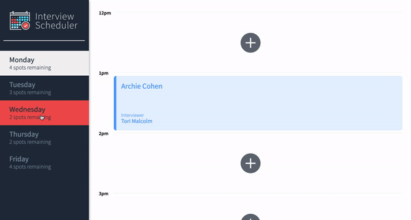
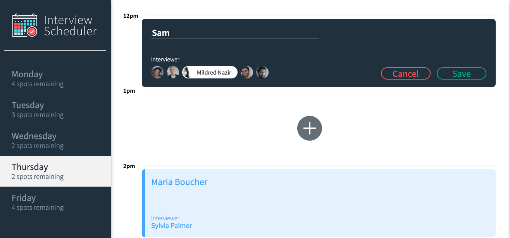

# Interview Scheduler

Interview Scheduler is a single-page React app that uses an API to load and persist data, allowing users to book and cancel interviews.

Unit, integration and end-to-end tests have been implemented in this project using Jest and Cypress.

## Final Product




## Dependencies

- axios
- classnames 
- cypress
- normalize.css 
- react
- react-dom
- react-scripts

## Setup

Install dependencies with `npm install`.

Clone Scheduler API from [here](https://github.com/houseofsam/scheduler-api) and follow the instructions provided in the README.

## Running Webpack Development Server

```sh
npm start
```

## Running Jest Test Framework

```sh
npm test
```

## Running Storybook Visual Testbed

```sh
npm run storybook
```

## Running Cypress 

```sh
npm run cypress
```